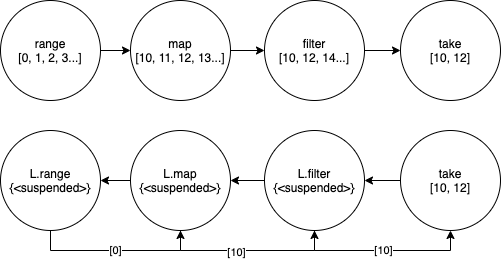

## 지연 평가란?

컴퓨터 프로그래밍에서 느긋한 계산법(Lazy evaluation)은 계산의 결과 값이 필요할 때까지 계산을 늦추는 기법이다. `위키피디아`

지연 평가를 이용하면, 불필요한 계산을 하지 않게 되어 성능상의 이점이 있으며, 무한의 자료구조를 사용할 수 있습니다. ES6에서 추가된 이터레이터와 제너레이터를 이용하여 지연 평가되는 함수를 작성해 보겠습니다.

## 배열을 리턴하는 range함수

숫자를 받아 숫자만큼의 배열을 리턴하는 함수를 작성해 보겠습니다.

### 일반적인 range

```jsx
const range = (l) => {
  let i = -1
  let res = []
  while (++i < l) {
    res.push(i)
  }
  return res
}

const list = range(5) // [0, 1, 2, 3, 4]
reduce((a, b) => a + b, list) // 11
```

### 지연 평가를 가지는 L.range

```jsx
const L = {}
L.range = function* (l) {
  let i = -1
  while (++i < l) {
    yield i
  }
}

const list = L.range(5) // L.range {<suspended>}
reduce((a, b) => a + b, list) // 11
```

두 가지의 range함수를 작성해 보았습니다. 하나는 배열에 값을 담아 리턴해주는 일반적인 함수이며, 나머지 하나는 제너레이터를 이용한 range함수입니다. 두 함수로 reduce 한 값은 11로 모두 동일하게 보입니다. 하지만 내부적으로 처리되는 방식은 다른데요, 일반적인 range 함수는 호출되는 즉시 배열 값을 리턴 하지만, 제너레이터를 이용한 L.range함수는 이터레이터 값을 리턴합니다.

## 입력된 길이 만큼 리턴하는 take

이번에는 배열의 길이와 배열을 전달하면 입력된 길이만큼 배열을 잘라서 리턴하는 take함수를 작성해보겠습니다.

```jsx
const take = (l, iter) => {
  let res = []
  for (const a of iter) {
    res.push(a)
    if (res.length == l) return res
  }
  return res
}
```

### take와 range를 이용한 지연 평가

```jsx
console.log(take(5, range(100))) // [0, 1, 2, 3, 4]
console.log(take(5, L.range(100))) // [0, 1, 2, 3, 4]
```

take 함수를 이용하여 range와 L.range에 적용해 보면 잘 작동하는 것을 확인할 수 있습니다.
하지만 둘의 내부적으로 작동하는 방식은 다릅니다. range함수는 요청을 받는 즉시 [0, 1, 2, 3…99]의 배열을 완성시켜 take 함수에 전달을 하지만 L.range 즉시 처리하지 않고 이터레이터 값을 전달을 합니다. 그렇게 전달받은 값을 take의 for of에서 하나식 결괏값을 호출하며 진행을 하게 되고, 결과적으로 take의 요청 값인 5번만 range값을 진행하게 됩니다.

## 지연 평가를 가지는 L.map, L.filter

같은 방식으로 이전에 만든 map과 filter 함수도 지연 평가를 가지도록 함수를 재구성해보겠습니다.

```jsx
L.map = function* (f, iter) {
  for (const a of iter) yield f(a)
}

L.filter = function* (f, iter) {
  for (const a of iter) if (f(a)) yield a
}
```

L.map과 L.filter는 제너레이터를 이용하여 지연성을 가지며 리턴되는 값은 결괏값이 아닌 이터레이터 값을 반환합니다.

## range, map, filter, take, reduce 중첩사용

지금까지 만든 지연 평가되는 함수들을 중첩으로 사용해 보겠습니다.

```jsx
go(
  range(10),
  map((n) => n + 10),
  filter((n) => n % 2),
  take(2),
)

go(
  L.range(10),
  L.map((n) => n + 10),
  L.filter((n) => n % 2),
  take(2),
)
```

두 개의 함수의 결괏값은 같지만 진행되는 방식은 다릅니다. 일반적인 range, map, filter 함수는 호출 즉시 값을 만들어 전달을 하지만 지연 평가되는 함수들은 값을 전달하지 않고 호출할 수 있는 이터레이터 값을 전달하며 계산을 미뤄줍니다.
L.range, L.map, L.filter에서 계산을 진행하지 않고, take 함수까지 도착하게 되면 그제야 계산을 시작하게 됩니다. take 함수에서 for of을 진행할 때 이제 iter에 있는 이터레이터 값을 호출하여 L.filter에서 값을 요청합니다. 그리고 L.filter에서도 이터레이터 값을 호출하여 L.map으로 요청하고 반복해서 L.range까지 요청하게 됩니다. L.range에서 값을 계산한 뒤 다시 map, filter, take 순으로 전달하게 됩니다.



값이 필요할 때에만 이터레이터를 호출하여 값을 계산하기 때문에 take 함수로 인해 값이 2개가 리턴되면 계산이 종료되게 됩니다. 따라서 모든 값을 계산하여 전달하는 일반적인 함수와 다르게 필요한 만큼만 계산해주는 지연 평가는 성능상에 이점이 있습니다.

## 참고

- [함수형 프로그래밍과 JavaScript ES6+](https://www.inflearn.com/course/functional-es6)
